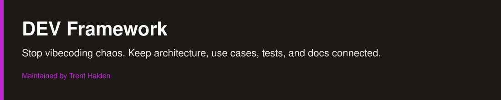
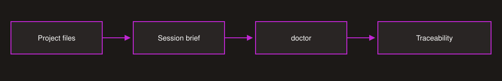

# DEV Framework



[](https://github.com/trenthalden/dev-framework/actions/workflows/verify.yml)


**Stop vibecoding chaos with an AI-native workflow that keeps architecture, use cases, tests, and documentation connected.**

That sentence means one thing: the project stores what it is for, what must not break, and how those claims are checked. An agent can read that context instead of reconstructing it from code alone. It does not mean the agent may change the project without a person accepting the result.

Two results you can see:

- architecture, use cases, tests, and docs stay linked, and `doctor` names a broken link;
- a reply has two equal blocks, in this order: `🛠️ Tech`, then `💬 Message`. Tech is the agent context. Message is for a person and must stand on its own.

**[Run the demo](#run-the-demo).** Installation is the first command in that demo.

Maintained by Trent Halden. Version source: [VERSION](VERSION). Changes: [CHANGELOG.md](CHANGELOG.md).

## Security and scope

Python 3.10+ and Git. The framework itself is the Python standard library only. No pip install.

| Question | Answer |
|---|---|
| What can it change? | Files inside the target project you name. A preview (`--dry-run`) writes nothing. |
| Network | Installing from GitHub needs network. There is no telemetry and no background process. |
| Session start | In a Claude Code framework project, one hook runs the plugin's own code, then `git fetch` on that project's upstream. Nothing is uploaded. If fetch fails, the brief says the upstream was not checked. |
| Where data sits | In the target project. An optional Devlog stays local and is git-ignored on a public repository. |
| Removal | There is no uninstaller. Delete the files the preview listed, after you review them. An update does not delete a file the package stopped shipping; it reports it and keeps it. |
| Platforms | Package tests run in CI on Windows and Ubuntu, Python 3.10 and 3.13. A live plugin walkthrough was done on Windows. macOS is not verified. |
| Secret scan | A text heuristic. Not a security audit. History and built artifacts are not scanned. |
| Vulnerability reports | No private channel is configured. See [SECURITY.md](SECURITY.md). Do not put secrets in a public issue. |

Codex, Cursor, and OpenCode do not have a native adapter in this version. An agent with a shell can run the same scripts. That is not a tested host integration.

## Run the demo

Use a new empty directory. The name below is synthetic. Do not point it at a project that already has files you care about.

```text
python scripts/install.py --target /tmp/field-notes --name "Field Notes" --profile generic --scale "1 user" --kind product --no-devlog --dry-run
```

Captured on 24 September 2026, Windows, from this tree: exit 0, the output ended with `PREVIEW ONLY`, and the target directory was not created.

Remove `--dry-run` to install. The installer then prints `Installed. Run doctor: scaffold is NOT a configured/verified project.`

```text
python .devframework/check.py doctor
```

A fresh project is supposed to stop here. Captured output:

```text
SETUP: Configure build command or a build_not_applicable reason
SETUP: Configure test command as an argv that prints a TESTS line, e.g. ["{python}", "-B", ".devframework/run_unittest.py", "--start", "tests", "--jobs", "auto"] (a bare `python -m unittest` or `pytest` passes doctor but fails finish: no TESTS line)
SETUP: Fill project facts in PROJECT.md
SETUP: Fill project facts in docs\ARCHITECTURE.md
STRUCTURE OK; PROJECT NOT READY (configuration required)
```

Exit code 2. Fill the named facts and set the test command. `doctor` can then print:

```text
DOCTOR READY: structure/configuration only; build/tests have not run
```

Exit code 0. That line does not mean the tests ran.

Remove the `Test` field from one use case and run `doctor` again. Captured output:

```text
ERRORS: Use case has no Test field: UC-001
STRUCTURE FAILED
```

Exit code 1. Restore the field. The check names the case; it does not fix it.

The same shape, as a reply must use it:

```text
🛠️ Tech
doctor exit 1. ERRORS: Use case has no Test field: UC-001

💬 Message
The check stopped because use case UC-001 no longer says how it is tested. Restore that field, then run doctor again.
```

## Two ways in

Neither route is hidden. The demo above is the short way to see a result before you point the framework at code you maintain.

| Route | First command |
|---|---|
| New project | `python scripts/install.py --target /path/to/new-project --name "New Project" --profile generic --scale "1 user" --kind product --dry-run` |
| Existing project | The same command, with that project's directory as `--target`. An existing `AGENTS.md` or `CLAUDE.md` stops the install before it writes. |

Both commands are previews until you remove `--dry-run`. Details, including Hermes and Claude Code: [docs/QUICKSTART.md](docs/QUICKSTART.md).

## What a project receives

Rules, a project fact file, a use-case catalogue, and small checks. No application runtime is installed.

| Kind | For | What `finish` proves |
|---|---|---|
| product | software that will have users | counted tests: more than zero ran, none failed |
| tool | one script or utility | the tool run on 1–3 examples |
| explore | not yet known | optional; without tests, `finish` says behaviour is not proven |

`testing` in `.devframework/project.json` is `lean` or `advanced`. Lean is one scenario test per promise a person can see, through the real entry point. Advanced is the stricter set, and `commit-check` refuses a use case that has no test. The installer recommends from kind and scale. The person decides.



The session brief is the agent context for the next session. `doctor` checks that the documents still point at each other. It does not decide whether a sentence is true.

## Customize safely

These are the supported switches in 1.6.1. There is no switch that turns `doctor` off.

- `--kind product|tool|explore` chooses the document set. A project can grow toward `product`. It does not shrink.
- `testing` chooses lean or advanced. At 10,000 users or more, lean prints a warning. It does not change the setting for you.
- `<!-- under-construction: reason (until YYYY-MM-DD) -->` on its own line in `PROJECT.md` or `docs/` skips that document's checks until the date. `doctor` names it on every run. Secrets, tests, and required files are still checked.
- `.devframework/project.json` holds the build and test commands. You review those commands. `doctor` does not sandbox them.

A profile selects a workflow. It cannot weaken the checks. Per-rule on/off switches are not in this version.

## Hosts

| Host | Install | Canonical command |
|---|---|---|
| Hermes Agent | `hermes plugins install trenthalden/dev-framework`, then `hermes plugins enable dev-framework` | tools `df_init`, `df_check`, `df_nav` |
| Claude Code | `/plugin marketplace add trenthalden/dev-framework`, then `/plugin install dev-framework@dev-framework` | `/dev-framework:df-init`, `/dev-framework:df-check`, `/dev-framework:df-nav` |
| Any agent with a shell | clone this repository | `python scripts/install.py`, then `.devframework/check.py` |

Older Claude commands `/dev-framework:init`, `check`, and `nav` are aliases for one release. Prefer the `df-` names.

Plugins load at process start. The Hermes desktop app needs a restart after enable. The Claude Code hook is silent outside a framework project, and it does not execute code from the repository you opened.

## Why this exists

An agent that sees only the current code spends the next session recovering decisions that were already made. The documents and the check are there so the next session can start from those decisions and can see when they no longer match.

No origin story is claimed beyond that.

## Limits

- `doctor` checks structure and the links it knows about. It does not know whether a use case describes the right store, or whether the tests test the right behaviour.
- `finish` runs the commands configured in the project. A green `doctor` is not a green `finish`.
- Recorded plugin-versus-skills numbers are in [evals/RESULTS.md](evals/RESULTS.md). The skills rows list grok-4.6 and the plugin rows list gpt-5.6-terra, so those ratios are not a same-model result.
- This release has 12 scenario tests. On 24 September 2026 they finished in 21.5 seconds on Windows, Python 3.11.15. Tag `dev-framework--v1.6.0` described 11. One machine is not a guarantee.
- CI on commit `9efa0d7` was green for Windows and Ubuntu, Python 3.10 and 3.13. That run does not include 1.6.1. The workflow runs again on this push; a past green run is not this release's result.

## Contributing

Issues and pull requests are welcome. There is no response-time commitment and no promise that a change will be accepted. See [CONTRIBUTING.md](CONTRIBUTING.md).

## License

[MIT](LICENSE). Copyright (c) 2026 Trent Halden.

This grant covers this repository. It does not cover a dependency's license, and it does not pre-approve a later module that is published separately.

Maintainer guide, including installer and host details: [MAINTAINER.md](MAINTAINER.md).
